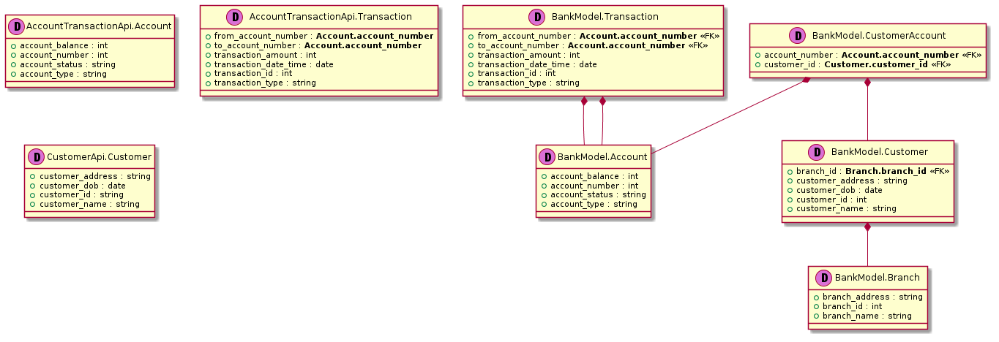
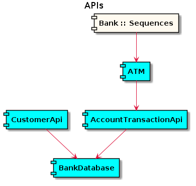
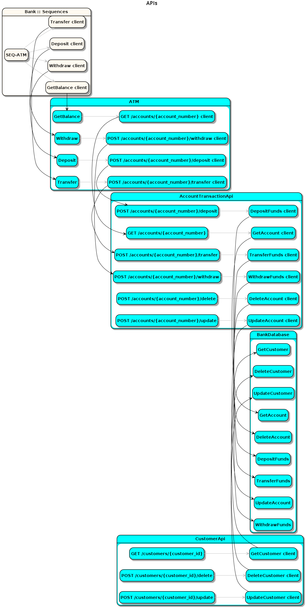

# Sysl Bank Example

This demo provides an example of a very simple banking system in which a `Customer` of a `Branch` can make a `Transaction` to move money in or out of an `Account`. The bank maintains records of these entities, and offers APIs to read and write customers and accounts.

## Outputs

### Data model diagram

```bash
sysl data --output data.png --project "Bank :: Data Views" ./project.sysl
```

[](out/data.png)

### Integration diagram

```bash
sysl ints --output ints.png --project "Bank :: Integrations" ./project.sysl
```

[](out/ints.png)

### Endpoint analysis diagram

```bash
sysl ints --epa --output epa.png --project "Bank :: Integrations" ./project.sysl
```

[](out/epa.png)

### Sequence diagram

For the ATM withdrawal endpoint:

```bash
sysl sd --output sd.png --endpoint "ATM <- Withdraw" ./project.sysl
```
[](out/sd.png)

### Database script

```bash
sysl generate-db-scripts --app-names BankModel ./bank.sysl
```

- [BankModel.sql](out/BankModel.sql)
