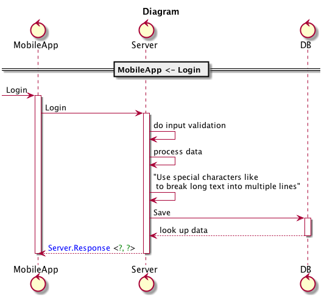
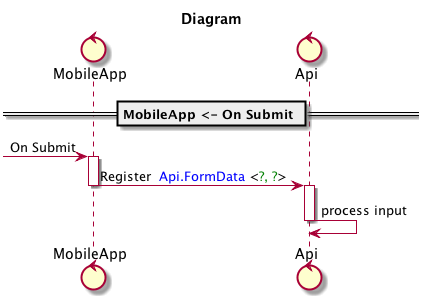

# Language Guide

Sysl is a system specification language (and toolkit). You describe applications and data models that make up your system and use `sysl` commands like `sd`, `ints` and `data` to render sequence, integration and data diagrams. Sysl can be extended using plugins. `reljam` is a plugin that reads intermediate representation generated by `sysl` to generate Spring based Java RestController for your API defined in sysl. `gosysl` is another plugin that generates `go` stubs for the same api definition.

Your complete system can be described as forest of trees, where one tree represents one application or data model.

Sysl uses indentation to represent parent child or `has` relationships. E.g. an  `application` has `endpoints` or a `table` has `columns`.

## Concepts
Sysl allows you to specify [Application](#application) behaviour and [Data Model](#data) that is shared between your applications. Another related concept is of software [Projects](#projects) where you can document what changes happened in each project or a release.

More on this below.

### Application
An application is an independent entity that provides services via its various `endpoints`. E.g. a `MobileApp` allows users to `Login`, `Search` or `Order` items.

Let's start to define a mobile app with these high level endpoints (or flows):
```
MobileApp:
  Login: ...
  Search: ...
  Order: ...
```
In the above example, `:` and `...` have special meaning. `:` is used to create a parent-child relationship.

`MobileApp` is a user-defined name that `has` three `endpoints` viz `Login`, `Search` and `Orders`. The way to do that is by having a `newline` and `indent` after `:`.

The `...` (aka shortcut) means, we don't have enough details yet to describe how this endpoint behaves. Sysl allows you to take an iterative approach in documenting the behaviour. You add more as you know more.

### Data
You will have various kinds of data passing through your systems. Sysl allows you to express ownership, information classification and other attributes of your data in one place.

Continuing with the previous example, let's define a `Server` that expects `LoginData` for the `Login` Flow.
```
Server:
  !type LoginData
    username <: string
    password <: string
```
Note: we have not defined how `Server` implements the `Login` flow.

### Projects
Most of the changes to your system will be done as part of a well defined `project` or a `software release`.

`TODO: Elaborate`
## Generate Diagrams

Sysl supports generating diagrams of following types:
  * Sequence Diagram
  * Integration Diagram
  * Data Diagram

Sysl aims to generate code and documentation from only one source of truth i.e. `.sysl` files.

## Generate Code

A common problem with documentation is that the code and documentation diverge pretty soon. `Sysl` lets to define `Rest API` and generate code for the same. You can describe the behaviour of the api for developers to follow and generate code and diagrams from same `.sysl` code. See section on [Rest](#rest) below.

Currently, Sysl generates Java code for the following
  * Sprint REST Controller
  * POJO classes for the types used in your api
  * Transformation Language to transform your data models e.g. from relational to object model (and vice-versa?)

## Parts of Sysl Language
Let's see how we can define application and data models in sysl.

### Application, Endpoint
As described above, here is how you can start to define an application.

`mobile.sysl`
```
MobileApp:
  Login: ...
  Search: ...
  Order: ...
```

Sysl expects all lines after `:` to be indented. The only exception to this rule is when you want to use the shortcut `...`. Sysl has support to generate code for defining `Rest` api servers. See [Rest](#rest) for more details.

### Data Models
#### Data Types
Sysl supports following data types out of the box.
  * int, int64, int32
  * float, decimal
  * string
  * bool
  * datetime, date
  * any
  * xml

#### Relational Data Model
Relational Data model is the most common way of persisting data in a database. You can define your data model directly in sysl.
`data.sysl`
```java
CustomerOrderModel:
  !table Customer:
    customer_id <: int [~pk]

  !table CustomerOrder:
    order_id <: int [~pk]
    customer_id <: Customer.customer_id
```
In the above example:
  *  Customer.customer_id is a primary key.
  *  CustomerOrder has a foreign key customer_id which refers to the primary key of Customer (i.e. customer_id).

See [data.sysl](assets/data.sysl) for complete example for Relation model.


#### Object Model
Define a typical in memory Object model of an application
```java
CustomerOrderModel:
  !type Address:
    line_1 <: string
    city <: string

  !type Customer:
    customer_id <: int
    addresses <: set of Address

  !type CustomerOrder:
    order_id <: int
    customer <: Customer
```
Note:

  * `set of Address` - Set is the only collection type

See [data.sysl](assets/data.sysl) for complete example for Object model.


#### Generate data model diagrams using the following command
```
sysl data --project Relational -o relational.png data
sysl data --project ObjectModel -o object.png data
```
#### Generate code using the following command
```
reljam model data Relational
reljam model data ObjectModel
```
where
  * `reljam`- Relational Java Model exporter
  * `model` - generate "model" code
  * `data`  - input data.sysl file.
  * `Relational` or `ObjectModel` - name of the Data model to generate code for.

You should see a Java file generated for each type. See [Data Models](#data-model) for more details.

##### Nested Data Models

Sysl has a shorter syntax to define types as well.
```java
Model:
  !type Request:
    header <:
      header_id <: int
    body <:
      details <: string
```
At the moment, reljam does not generate code for this. See issue [#155](https://github.com/anz-bank/sysl/issues/155).

### Imports

To keep things modular, sysl allows you to import definitions created in other `.sysl` files.

E.g. `server.sysl`
```
Server:
  Login: ...
  Register: ...
```

and you use `import` in `client.sysl`

```js
import server

Client:
  Login:
    Server <- Login
```

Above code assumes, server and client files are in the same directory. If they are in different directories, you must have atleast a common root directory and `import /path/from/root`.

All sysl commands accept `--root` argument. Run `sysl -h` or `reljam -h` for more details.

#### Multiple Declarations

Sysl allows you to define an application in multiple places. There is no redefinition error in sysl.

```
UserService:
  Login: ...

UserService:
  Register: ...
```

Result will be as-if it was declared like so:

```
UserService:
  Login: ...
  Register: ...
```

### Statements
Our `MobileApp` does not have any detail yet on how it behaves. Let's use sysl statements to describe behaviour. Sysl supports following types of statements:
  * [Text](#text)
  * [Call](#Call)
  * [Return](#return)
  * [Control Statements](#control-statements)
  * [Arguments](#arguments)

#### Text
Use simple text to describe behavior. See below for examples of text statements:
```
Server:
  Login:
    do input validation
    "Use special characters like \n to break long text into multiple lines"
    'Cannot use special characters in single quoted statements'
```

#### Call
A standalone service that does not interact with anybody is not a very useful service. Use the `call` syntax to show interaction between two services.

In the below example, MobileApp makes a call to backend Server which in turn calls database layer.

```
MobileApp:
  Login:
    Server <- Login

Server:
  Login:
    do input validation
    process data
    "Use special characters like \n to break long text into multiple lines"
    DB <- Save
    return success or failure

DB:
  Save:
    ...
```
##### You can generate the Sequence Diagram using the following command:

```bash
sysl sd -o 'call-login-sequence.png' -s 'MobileApp <- Login' call.sysl
```
You can omit the the `.sysl` and sysl will pickup the correct file.
```bash
sysl sd -o 'call-login-sequence.png' -s 'MobileApp <- Login' call
```

Here is the output that you should see:



See [assets/call.sysl](assets/call.sysl) for complete example.

#### How sysl generates sequence diagram?
Let's breakdown the `sd` aka `sequence diagram` command:
```bash
sysl sd -o 'call-login-sequence.png' -s 'MobileApp <- Login' call.sysl
```
  * `-o` specifies the output filename
  * `-s` specifies the start endpoint
  * `call.sysl` the source to start the analysis from

Sysl analyzes the starting endpoint and finds all the `call`s that this endpoint makes to other endpoints (including the ones to other applications). It finds all the transitive dependencies till there are none.

In the above diagram, `DB` is the last app in this flow. Sysl also captures the return data that each endpoint returns to its caller. See below for more details.

#### Return response
Express returning response to the caller by using the `return` keyword. See the example above on how to use the `return` keyword.
```
App:
  Endpoint:
    return STRING | TYPE
```
In the above example, everything after `return` keyword till the end-of-line is considered response. You can have:
  * STRING - a descrition of what is returned
  * TYPE - Sysl type

Sequence diagram will render the response accordingly. In the previous example, `look up data` is a generic description of what `DB <- Save` returns. `Server.Response` is the Sysl type that is returned by `Login` endpoint.

#### Control statements
Sysl allows you to express high level of detail about your design. You can specify decisions, processing loops etc.

##### If, else
You can express an endpoint's critical decisions using IF/ELSE statement:

```
Server:
  HandleFormSubmit:
    validate input
    IF session exists:
      use existing session
    Else:
      create new session
    process input
```
See [assets/if-else.sysl](assets/if-else.sysl) for complete example


##### For, Loop, Until, While
Express processing loop using FOR:
```
Server:
  HandleFormSubmit:
    validate input
    For each element in input:
      process element
```
See [assets/for-loop.sysl](assets/for-loop.sysl) for complete example.


You can use `Loop`, `While`, `Until`, `Loop-N` as well.

#### Arguments
Define the data that you expect your callers to pass you. In the below example, `register` endpoint in service `Api` expects `input` of type `FormData`. `FormData` is defined under the application `Api`.

You can instruct `sysl` to show the arguments to your endpoint in a sequence diagram.

```
MobileApp:
  Register:
    Api <- Register

Api:
  Register(input <: Api.FormData):
    process input

  !type FormData:
    name <: string
    age <: int
```
Command:

`sysl sd -o args.png --epfmt '%(epname) %(args)' -s 'MobileApp <- On Submit' args.sysl`

See [assets/args.sysl](assets/args.sysl) for complete example.



A bit more explanation is required regarding `epname` and `args` keywords that are used in `epfmt` command line argument. See section on [Attributes](#epfmt) below.

#### Events, publisher and subscriber

Sysl has support for the publisher-subscriber model. In the example below, `UserService` has `RegisterEvent` that is subscribed by `EmailNotifier` and `SmsNotifier` applications.

```
UserService:
  <-> RegisterEvent: ...

  Register:
    do registration
    . <- RegisterEvent

EmailNotifier:
    UserService -> RegisterEvent:
        EmailNotifier got the RegisterEvent

SmsNotifier:
    UserService -> RegisterEvent:
        SmsNotifier got RegisterEvent

```


#### Collector

Project files use the Collector syntax to add additional layer of information on top of the defintions. Best example of this is where you want to capture how an API evolved over time.

E.g. `server.sysl`
```
Server:
  Login:
    do input validation
    DB <- Save
    return success or failure

  Read User Balance:
    DB <- Load
    return balance
```

Say, in  `project-1.sysl` you modified the call to `DB <- Save`, you can capture this information like so:
```
Server [status="modified"]:
  .. * <- *:
    Login [status="modified"]
    DB <- Save [status="modified"]
```
`.. * <- *` is the way to tell sysl to take an existing definition of the application and `merge` the attributes from:

  * endpoints
  * calls

Then for diagrams related to Project-1, you can show this information in the diagrams which endpoints are getting reused and which ones are new. This requires usage of `epfmt`, where you can use the value of the variable `status` like so `%(@status)`. See [Attributes](#attributes) for more details.

By creating separate file for each project, you will always be able to recreate necessary documentation at that point in time. This can help you answer questions like `When or why was this introduced?`.

### Attributes

You can attach more metadata to your application specification. This information can be used by sysl plugins to extend the default functionality. The attributes are added inside square brackets `Application [...attributes]`. Sysl attributes are of two types: `Patterns` and `Key-Value` pairs:

  * Patterns

    A pattern is `~` followed by a word that means something to you. E.g. `[~tag]`.

    ```
    Application [~rest]:

    ```
    In the above example, `rest` is a pattern.

  * Key-Value pair

    As the name suggests, you can associate some data with your application or an endpoint.
  ```
  Application [version="1.1"]:
  ```

  The value can be a string `"foo"`, an array of strings `["foo", "bar"]`, array of array of strings `[["foo"], ["bar"]]`

  A complete example:

  ```
  BizApp [version="1.1", clients=["web", "daemon"]]:
  ```

#### Reserved Attributes

Sysl defines some internal attributes that you can use to customize the look of your diagrams.

  * Changing Application icons in Sequence Diagram

    The default icon for the app is a `circle with an arrow`. You can change this icon to:

    * human - `App [~human]:`
    * database - `DataBase [~db]`
    * External App - `IdentityProvider [~external]` - In an enterprise system, you might have some external third-party system that your app might interact with. Mark an app as `~external` and sysl will place that app at extreme right of a sequence diagram.

Complete example that uses the above patterns:

  ```
  User [~human]:
    Check Balance:
      MobileApp <- Login
      MobileApp <- Check Balance

  MobileApp [~ui]:
    Login:
      Server <- Login
    Check Balance:
      Server <- Read User Balance

  Server:
    Login:
      do input validation
      DB <- Save
      return success or failure

    Read User Balance:
      DB <- Load
      return balance

  DB [~db]:
    Save: ...
    Load: ...

  Project [seqtitle="Diagram"]:
    Seq:
      User <- Check Balance
  ```

Here is the result:


### Using attributes in appfmt and epfmt

`appfmt` and `epfmt` (app and endpoint format respectively) can be passed to `sd`, `ints` commands. They control how the application or endpoint name is rendered as text. There default value is `%(appname)` and `%(epname)` respectively. These internal attributes are:

    * appname - short name of the application
    * epname - short name of the endpoint
    * eplongname - Long quoted name of the endpoint.
    * controls - controls defined on your endpoint

  Complete example:

  ```
  App "Descriptive Long Application name":
    Endpoint-1 "Descriptive Long name for Endpoint 1":
      ...
    Endpoint-2 "Descriptive Long name for Endpoint 2":
      ...
  ```
  Where:
   * appname - App
   * epname - Endpoint-1 or Endpoint-2
   * eplongname - "Descriptive Long name for Endpoint 1" or "Descriptive Long name for Endpoint 2"

  You can also refer to the attributes that you added by using `[]` or the Collector syntax.

#### Using user defined attributes in fmt

You can use your attributes in `epfmt` or `appfmt` arguments in the following ways:

  * `%(@attrib_name)` : use `@` to refer to `attrib_name`.
  * `%(@attrib_name? yes_stmt | no_stmt)`: use `?` to test for existence of value. This is ternary operator, which allows you to to execute `yes_stmt` or `no_stmt` depending on the result.
  * `%(@attrib_name=='some_value'? yes_stmt | no_stmt)` : compare attribs_value to some constant
  * `%(@attrib_name=='some_value'? yes_stmt | @attrib_name=='some_other_value'? | ...)` : nested checks.


  Now, `stmt` can be any of the following types:
  * plain-text:  will be copied as-is to the output
  * `<color red>text or %(attrib_name)</color>`: use html like syntax to color the output.

Example:
```html
appfmt="%(@status?<color red>%(appname)</color>|%(appname))"
epfmt="%(@status? <color green>%(epname)</color>|%(epname))"
```

See [attribs.sysl](assets/attribs.sysl) for complete example. Notice how `appfmt` and `epfmt` use `%(@status)`.


#### Rest

Rest is a very common architectural style for defining web services. Here is how you can define a web service:

```
Server:
  /path:
    HTTP_METHOD:
      <describe behaviour using statements>
```

where

`HTTP_METHOD` can be one of `GET`, `PUT`, `POST`, `DELETE` and `PATCH`.


Nested-Paths:

You can breakdown long URL's to reduce repetition. See below for complete example:

```

AccountTransactionApi [package="io.sysl.account.api"]:
    /accounts [interface="Accounts"]:
        /{account_number<:int}:
            GET:
              BankDatabase <- GetAccount(account_number)

            /withdraw:
              POST (Transaction):
                BankDatabase <- WithdrawFunds(account_number)

            /transactions:
              GET ?start_date=string&end_date=string:
                BankDatabase <- QueryTransactions(account_number, start_date, end_date)

    !type Account:
        account_number <: int?
        account_type <: string?
        account_status <: string?
        account_balance <: int?

    !type Transaction:
        transaction_id <: int?
        transaction_type <: string?
        transaction_date_time <: date?
        transaction_amount <: int?
        from_account_number <: Accounts.account_number
        to_account_number <: Accounts.account_number

ATM:
    GetBalance:
        AccountTransactionApi <- GET /accounts/{account_number}
        Return balance
    Withdraw:
        AccountTransactionApi <- POST /accounts/{account_number}/withdraw
        Withdraw funds
```

Here are few things to notice
  * `interface` attribute allows you to specify the name of the generated interface class. This interface has all the methods of your api.
  * Query parameters `start_date` and `end_date` (of type `string`) that you can pass to `GET    /accounts/{account_number}/transactions` endpoint.
  * `ATM <-GetBalance` makes a call to `AccountTransactionApi <- GET /accounts/{account_number}`.

See [api.sysl](assets/api.sysl) for complete example.

Command to generate code:

Run this in the same directory as `api.sysl`:
```
reljam spring-rest-service api AccountTransactionApi
```

# Data Model
`TODO: elaborate how Model / View / Facade works`
## Model
## View
## Transformation
## Facade

