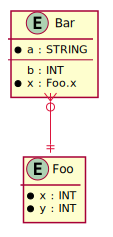

# Data Diagram

Generates an entity-relationship diagram from the types of a Sysl model.

```bash
$ arrai run data_diagram.arrai
@startuml
skinparam component {
  BackgroundColor FloralWhite
  BorderColor Black
  ArrowColor Crimson
}
hide methods

entity Bar {
  *a : STRING
  --
  b : INT
  *x : Foo.x
}

entity Foo {
  *x : INT
  *y : INT
}

Bar             }o--|| Foo

@enduml
```


