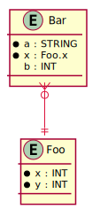

# Data Diagram

Generates an entity-relationship diagram from the types of a Sysl model.

```bash
$ arrai run data_diagram.arrai
@startuml
skinparam component {
  BackgroundColor FloralWhite
  BorderColor Black
  ArrowColor Crimson
}

entity Bar {
  *a : STRING
  *x : Foo.x
  b : INT
}

entity Foo {
  *x : INT
  *y : INT
}


Bar             }o--|| Foo
@enduml
```


