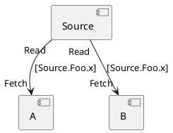

# Data Flow Analysis

This is an experimental solution to use sysl as a way to track how data is
transferred from one endpoint to another.

To try it, use the following command:

```bash
./test.sh \<sysl file\> \<type/field name\>
```

For example:

```bash
./test.sh ../model.sysl "Source.Foo.x"
```

outputs:




