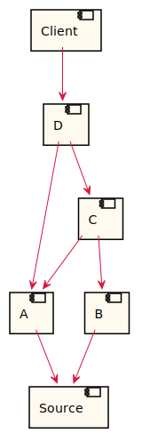

# Integration Diagram

Generates the PlantUML for an integration diagram of `model.sysl`.

```bash
$ arrai run integration_diagram.arrai
@startuml
skinparam component {
  BackgroundColor FloralWhite
  BorderColor Black
  ArrowColor Crimson
}
[A] --> [Source]
[B] --> [Source]
[C] --> [A]
[C] --> [B]
[Client] --> [D]
[D] --> [A]
[D] --> [C]
@enduml
```


