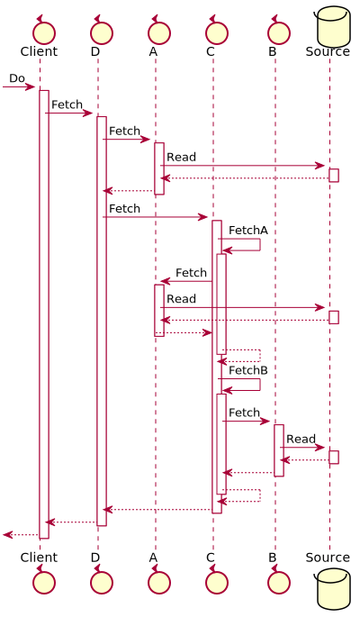

# Sequence Diagram

Generates the PlantUML for a sequence diagram of `Client <- Do` in `model.sysl`.

```bash
$ arrai run sequence_diagram.arrai
@startuml
skinparam maxMessageSize 250
control "Client"
control "D"
control "A"
control "C"
control "B"
database "Source"

 -> Client : Do
activate Client
Client -> D : Fetch
activate D
D -> A : Fetch
activate A
A -> Source : Read
activate Source
A <-- Source
deactivate Source
D <-- A
deactivate A
D -> C : Fetch
activate C
C -> C : FetchA
activate C
C -> A : Fetch
activate A
A -> Source : Read
activate Source
A <-- Source
deactivate Source
C <-- A
deactivate A
C <-- C
deactivate C
C -> C : FetchB
activate C
C -> B : Fetch
activate B
B -> Source : Read
activate Source
B <-- Source
deactivate Source
C <-- B
deactivate B
C <-- C
deactivate C
D <-- C
deactivate C
Client <-- D
deactivate D
 <-- Client
deactivate Client
@enduml
```


